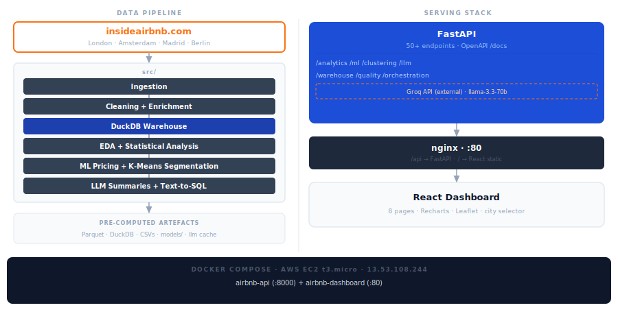

# Inside Airbnb — Multi-City Data Pipeline

**Experne'c Talent Assessment · Data Engineer Intern**

FastAPI-first pipeline covering ingestion → cleaning → enrichment → warehouse → EDA → statistical analysis → ML pricing models → K-Means market segmentation → LLM narrative summaries → Text-to-SQL Q&A for London, Amsterdam, Madrid, and Berlin.

**FastAPI is the canonical interface.** Every pipeline step is exposed as an HTTP endpoint. CLI wrappers (`python -m src.X.Y`) exist for shell users and call the same functions.

---

## Quick Start

If the pipeline artefacts (`data/processed/`, `models/`, `reports/tables/`) are already present:

```bash
python -m venv .venv
.venv\Scripts\activate          # Windows
# source .venv/bin/activate    # macOS / Linux
pip install -r requirements.txt

uvicorn src.api.app:app --reload --port 8000
```

Interactive docs: **http://localhost:8000/docs**

Starting from scratch? See **[Full Setup](#full-setup)** below — the pipeline must run first.

---

## Cities

| City | Snapshot | Raw listings | Filtered (price > 0) | Unique hosts | Currency |
|---|---|---|---|---|---|
| London | 2025-09-14 | 96,871 | 61,963 | 55,646 | GBP |
| Amsterdam | 2025-09-11 | 10,480 | 5,874 | 9,201 | EUR |
| Madrid | 2025-09-14 | 25,000 | 18,953 | 10,453 | EUR |
| Berlin | 2025-09-23 | 14,274 | 9,264 | 9,464 | EUR |

Source: https://insideairbnb.com/get-the-data/

> **Note — New York City (2025-12-04):** NYC was evaluated as a 5th city but all 36,261 listings had null prices. Airbnb stopped exposing nightly prices in NYC scrapes following enforcement of New York City Local Law 18 (September 2023), which heavily restricted short-term rentals. Ingest and warehouse steps completed successfully; ML and clustering were skipped due to the absence of a price signal.

---

## Key Results

### Price Prediction

| City | Best Model | Test MAE | R² (log) | Within 20% |
|---|---|---|---|---|
| London | LightGBM | £77.47 | 0.690 | 49.6% |
| Amsterdam | LightGBM | €80.68 | 0.617 | 54.1% |
| Madrid | Random Forest | €46.85 | — | — |
| Berlin | LightGBM | €46.44 | — | — |

- Train/test split: **GroupShuffleSplit by host_id** — same host cannot appear in both splits
- Target: **log1p(price)** — back-transformed to currency for MAE reporting
- Madrid and Berlin achieve lower MAE than Amsterdam despite fewer training rows — smaller, more homogeneous markets are inherently easier to predict
- Known bias: luxury listings (>£500 / >€700) are systematically **underpredicted** — regression-to-mean effect from log-price target

**Cross-city transfer (London model → Amsterdam):** MAE degraded from €81 to €175, R²(log) from +0.617 to −2.058. Root cause: TargetEncoder trained on London neighbourhoods maps all 22 Amsterdam neighbourhoods to the London global mean. Per-city retraining is required.

### Market Segmentation (K-Means — auto-detected k)

**London** (k=5)

| Cluster | Segment Name | % of city | Median £ |
|---|---|---|---|
| 3 | Outer City Budget Rooms | 22.3% | £67 |
| 1 | High-Turnover City Lets | 14.5% | £96 |
| 4 | New & Unreviewed Listings | 2.7% | £121 |
| 2 | Standard City Apartments | 33.5% | £134 |
| 0 | Premium Spacious Apartments | 26.9% | £262 |

**Amsterdam** (k=5)

| Cluster | Segment Name | % of city | Median € |
|---|---|---|---|
| 3 | High-Turnover Private Rooms | 17.0% | €147 |
| 2 | Part-Time City Apartments | 30.2% | €187 |
| 4 | New & Unreviewed Listings | 3.1% | €195 |
| 1 | Well-Available City Apartments | 20.8% | €241 |
| 0 | Premium Spacious Apartments | 28.9% | €333 |

**Madrid** (k=8)

| Cluster | Segment Name | % of city | Median € |
|---|---|---|---|
| 4 | Budget Rooms | 12.2% | €58 |
| 3 | Economy Apartments | 10.4% | €62 |
| 1 | New & Unreviewed Listings | 2.6% | €95 |
| 6 | High-Turnover City Lets | 17.2% | €105 |
| 7 | Part-Time City Apartments | 14.4% | €108 |
| 0 | Luxury Listings | 21.6% | €120 |
| 5 | Premium Spacious Apartments | 7.4% | €150 |
| 2 | Premium Spacious Apartments (large) | 14.3% | €225 |

**Berlin** (k=8)

| Cluster | Segment Name | % of city | Median € |
|---|---|---|---|
| 5 | Well-Available City Apartments | 22.8% | €72 |
| 4 | Economy Apartments | 7.3% | €85 |
| 6 | Part-Time City Apartments | 18.6% | €89 |
| 1 | High-Turnover City Lets | 15.2% | €98 |
| 2 | New & Unreviewed Listings | 1.4% | €100 |
| 3 | Luxury Listings | 15.4% | €125 |
| 0 | Premium Spacious Apartments | 12.2% | €195 |
| 7 | Premium Spacious Apartments (large) | 7.3% | €250 |

All four cities produce the same core archetypes — budget/economy tiers, high-turnover lets, new/unreviewed fringe, mid-market apartments, premium spacious — confirming the segment structure is universal. Madrid and Berlin auto-selected k=8 vs k=5 for London/Amsterdam, reflecting more granular price tiers in mid-sized markets.

### Host Segmentation (K-Means on host portfolios)

| City | k | Segment Name | Hosts | % | Key signal |
|---|---|---|---|---|---|
| London | 3 | Passive Listers | 6,788 | 12.2% | 53% response, 24% acceptance — disengaged |
| London | 3 | Professional Superhosts | 9,925 | 17.8% | 79% superhost, 4+ listings, actively booked |
| London | 3 | Occasional Hosts | 38,933 | 70.0% | Responsive, part-time (81 avail days/year) |
| Amsterdam | 2 | Active Superhost Operators | 1,270 | 13.8% | 65% superhost, 2.83 reviews/month |
| Amsterdam | 2 | Part-Time Apartment Hosts | 7,931 | 86.2% | 97% entire home, rarely booked |
| Madrid | 5 | Passive Listers | 665 | 6.4% | 19% response, 22% acceptance — disengaged |
| Madrid | 5 | Active Superhost Operators | 2,408 | 23.0% | 97% superhost, 2.88 reviews/month |
| Madrid | 5 | Premium Hosts | 4,113 | 39.3% | 98% entire home, responsive non-superhosts |
| Madrid | 5 | Occasional Hosts | 3,113 | 29.8% | Low availability, mostly private rooms |
| Madrid | 5 | Luxury Hosts | 154 | 1.5% | 24+ listings, professional operators |
| Berlin | 3 | Passive Listers | 1,044 | 11.0% | 60% response, 29% acceptance — disengaged |
| Berlin | 3 | Occasional Hosts | 5,658 | 59.8% | Responsive, very low availability (69 days) |
| Berlin | 3 | Professional Superhosts | 2,762 | 29.2% | 68% superhost, 1.83 reviews/month |

Silhouette scores — listings: London 0.151, Amsterdam 0.155, Madrid 0.150, Berlin 0.172. Hosts: London 0.266, Amsterdam 0.366, Berlin 0.235, Madrid 0.171. Hosts cluster more naturally than listings in all cities. **Passive Listers appear in every city** — a universal platform health signal.

---

## Implementation Status (§11.1)

Cross-reference of every assessment section against what was delivered.

### Completed ✅

| Section | Deliverable | Evidence |
|---|---|---|
| §1 Dataset Familiarisation | Schema profiling, candidate-key analysis, field assumptions (A-001–A-036), data limitations | `reports/file_purpose.md`, `reports/assumptions_log.md`, `reports/data_limitations.md`, `GET /familiarization/*` |
| §2 Data Ingestion | City-agnostic download pipeline, manifest, quality report; all 4 cities | `src/ingestion/`, `POST /ingestion/all?city=*` |
| §3 Data Cleaning | Rejection records, silver-layer Parquet, pytest data-quality suite (13/13 checks pass) | `src/cleaning/`, `tests/`, `GET /completion-gate` |
| §3 DuckDB Warehouse | Star schema (5 dims + 3 facts), 8 tables, named SQL queries, SCD-2 placeholders on `dim_host` | `data/processed/{city}/warehouse.duckdb`, `sql/`, `GET /warehouse/*` |
| §3 FastAPI Service | 50+ endpoints across 10 routers; OpenAPI docs at `/docs` | `src/api/`, `GET /index` |
| §3.6 Cloud Deployment | AWS EC2 t3.micro (free tier); Docker + Compose; public endpoint at 13.53.108.244 | `Dockerfile.api`, `Dockerfile.dashboard`, `docker-compose.yml`, `docker-compose.cloud.yml`, `scripts/deploy.sh` |
| §4.1 Price Distributions | Histogram, room-type boxplots, neighbourhood medians (top 15), CI bands, distance-band gradient | `reports/tables/*/price_by_room_type.csv`, `price_by_neighbourhood.csv`, `price_by_distance_band.csv` |
| §4.2 Neighbourhood Analysis | Listing-density choropleth, median-price map, room-type mix heatmap | `reports/tables/*/neighbourhood_*.csv`, `GET /analytics/geographic/*` |
| §4.3 Host Tenure Distributions | Listing count, median price, occupancy rate (30%→92%), superhost rate, rating by tenure band; all 4 cities | `reports/tables/*/host_tenure_summary.csv`, dashboard Hosts page |
| §4.4 Temporal Patterns | Monthly occupancy/availability trend, review volume 2009–2025, weekday vs weekend, min-nights policy | `reports/tables/*/monthly_availability.csv`, `weekday_weekend_summary.csv` |
| §4.5 Review Count / Score / Price | Price and rating by review-count bucket (0→100+); high-review / low-score anomaly listings; sub-dimension correlation matrix | `reports/tables/*/review_price_score_buckets.csv`, `high_review_low_score_listings.csv`, dashboard Statistics page |
| §5 Hypothesis Testing | 5 tests (Mann-Whitney, Kruskal-Wallis) with p-value, effect size, conclusion; α = 0.05 | `reports/tables/*/hypothesis_tests.csv`, `GET /analytics/stats/hypothesis-tests` |
| §5 OLS Regression | Log-price ~ room type + neighbourhood + host + availability; R², F-stat, coefficients | `reports/tables/*/regression_*.csv`, `GET /analytics/stats/regression/*` |
| §6 ML Price Prediction | LightGBM (best city MAE: £77 London, €46 Berlin); GroupShuffleSplit by host_id; SHAP + permutation importance; cross-city transfer test | `models/{city}_price_model.joblib`, `reports/model_results/`, `POST /analytics/ml/predict` |
| §7 Market Segmentation | K-Means listing clustering (auto-k: 5 or 8 per city); silhouette scoring; interpretable segment names | `models/{city}_kmeans.joblib`, `reports/model_results/clustering_profile_*.csv`, `GET /analytics/clustering/*` |
| §8 Host Segmentation | K-Means on per-host portfolio aggregates (13 features); Passive Listers / Professional Superhosts / Occasional Hosts pattern universal across all cities | `models/{city}_host_kmeans.joblib`, `GET /analytics/clustering/host-*` |
| §9 LLM Narrative Summaries | Groq-backed city overview, model performance, cluster, and host narratives; disk-cached; cross-city comparative | `src/llm/`, `reports/llm_summaries/`, `GET /analytics/llm/summary` |
| §9 Text-to-SQL Q&A | Natural-language → DuckDB SQL → explanation; schema-aware prompt; read-only guard | `src/llm/sql_runner.py`, `POST /analytics/llm/ask` |
| §10 Interactive Dashboard | React + Vite + Tailwind; 8 pages; city selector; Leaflet choropleth maps; Recharts; served via nginx reverse-proxy | `dashboard/`, live at `http://13.53.108.244` |
| §11.2 Engineering Decisions | 20+ decisions documented with problem / options / selected / trade-offs | `reports/engineering_decisions.md` |
| §11.3 Data Limitations | A-005 calendar-price null, single-snapshot caveat, review-count bias, host-identity ambiguity | `reports/data_limitations.md` |
| §11.4 Assumptions Log | A-001–A-036: field-level assumptions, scraping artefacts, calendar interpretation | `reports/assumptions_log.md` |

### Partial ⚠️

| Section | Gap | What exists |
|---|---|---|
| §5 Effect sizes | Cohen's d / eta-squared not in output | p-value, test statistic, and a narrative effect label are present but not a standardised effect-size coefficient |
| §5 Multicollinearity | VIF not computed | OLS coefficients and R² are available; no variance inflation factor table |
| §5 Correlation matrix | No full feature-correlation matrix endpoint | Sub-dimension review correlations exist (`GET /analytics/reviews/subdimensions`); listing-feature Pearson matrix not exposed |
| §10 Architecture diagram | Diagram covers pipeline and serving but not the DuckDB star-schema detail or ML feature flow | `reports/architecture.svg` — embedded in §Architecture Diagram above |

### Not Implemented ❌

| Section | Deliverable | Reason / Notes |
|---|---|---|
| §12 PDF Report | Minimum 20-page written report (15 sections) | Not produced — all findings live in `reports/eda_findings.md`, the dashboard, and API responses |
| §11 Presentation Deck | Slide deck summarising methodology and findings | Not produced |
| §4 Demand Forecasting | Availability / occupancy prediction over time | Single-snapshot dataset; no multi-snapshot time series available to train a forecasting model |

---

## Project Layout

```
config/
  cities.yml                city configs — URLs, snapshot dates, currencies

data/                       (gitignored — regenerated by pipeline)
  raw/                      downloaded CSV files
  processed/
    london/
      listing_master.parquet    71 enriched features
      feature_matrix.parquet    36 ML features (scaled/encoded)
      clustering_features.parquet  9 K-Means features
      clustering_labels.parquet    listing → cluster assignments
      warehouse.duckdb          star-schema warehouse
    amsterdam/                same structure
    madrid/                   same structure
    berlin/                   same structure

models/
  {city}_price_model.joblib       trained LightGBM pipeline (all 4 cities)
  {city}_kmeans.joblib            listing K-Means artifact (scaler + model + metadata)
  {city}_host_kmeans.joblib       host K-Means artifact
  {city}_model_metadata.json      35-key model card

reports/
  tables/                   London EDA CSVs (23 files)
  tables/amsterdam/         Amsterdam EDA CSVs (23 files)
  tables/madrid/            Madrid EDA CSVs (23 files)
  tables/berlin/            Berlin EDA CSVs (23 files)
  llm_summaries/            Cached Groq narrative summaries (city + cross-city)
  model_results/            ML + clustering outputs (all cities)
    full_model_comparison_{city}.csv
    feature_importance_permutation_{city}.csv
    feature_importance_shap_{city}.csv
    residuals_enriched_{city}.csv
    neighbourhood_error_analysis_{city}.csv
    room_type_error_analysis_{city}.csv
    price_band_error_analysis_{city}.csv
    cross_city_transfer_results.csv
    elbow_scores_{city}.csv
    clustering_profile_{city}.csv
  eda_findings.md
  assumptions_log.md
  engineering_decisions.md
  lineage.md

src/
  api/
    app.py                  FastAPI application (v2.0.0)
    routes/
      analytics.py          EDA results + ML predict + Clustering endpoints
      llm.py                LLM summary + Text-to-SQL endpoints
      cities.py
      cleaning.py
      enrichment.py
      familiarization.py
      ingestion.py
      orchestration.py
      quality.py
      warehouse.py

  analytics/
    run_eda.py              City-agnostic EDA + statistical analysis generator
                            (produces all 22 CSVs per city incl. hypothesis tests
                            and OLS regression; replaces per-city notebooks)

  llm/
    client.py               Groq API wrapper — call_once, generate, disk cache
    context_builder.py      Builds data context strings from EDA/ML CSVs
    prompts.py              System and user prompt templates
    schema_inspector.py     Reads DuckDB warehouse schema for Text-to-SQL
    sql_runner.py           Validates and executes LLM-generated SELECT statements

  features/
    listing_features.py     Build 36-feature ML matrix
    clustering_features.py  Build 9-feature listing clustering matrix
    host_features.py        Build 13-feature host clustering matrix

  models/
    train_price_model.py    LightGBM training pipeline
    evaluate.py             Full evaluation — MAE, RMSE, MAPE, R², within-20%
    explain.py              SHAP + permutation importance
    cluster_listings.py     Elbow sweep + K-Means fit (listings)
    cluster_profiles.py     Listing cluster profiling and segment naming
    cluster_hosts.py        Elbow sweep + K-Means fit (hosts)
    host_cluster_profiles.py  Host cluster profiling and segment naming

  ingestion/  cleaning/  transformation/  loading/  validation/  orchestration/
    (core pipeline)

notebooks/
  01_dataset_familiarization.ipynb
  03_exploratory_data_analysis.ipynb   (London EDA)
  04_statistical_analysis.ipynb        (London & Amsterdam hypothesis tests)
  05_amsterdam_eda.ipynb

dashboard/                  React + Vite + Tailwind interactive dashboard
  src/pages/
    Overview.tsx  Pricing.tsx  Hosts.tsx  Temporal.tsx
    Statistics.tsx  Comparison.tsx  AI.tsx

sql/                        named DuckDB queries
tests/                      pytest data-quality test suite
```

---

## Full Setup

**Prerequisites:** Python 3.11+, Node.js 20+ (dashboard only), Git

```bash
# 1. Create and activate virtual environment
python -m venv .venv
.venv\Scripts\activate        # Windows
source .venv/bin/activate     # macOS / Linux

# 2. Install Python dependencies
pip install -r requirements.txt

# 3. Set the Groq API key (required for /analytics/llm/* endpoints)
echo "GROQ_API_KEY=your_key_here" > .env
# Free key at https://console.groq.com — all other endpoints work without it

# 4. Run the full pipeline for all four cities (see "Running the Pipeline" below)
# Data is downloaded automatically by the ingestion step — no manual download needed.
# Steps must run in order 1 → 9; the server reads the artefacts they produce.

# 5. Start the API server
uvicorn src.api.app:app --port 8000
```

Interactive docs: **http://localhost:8000/docs**

---

## Running the Pipeline

Steps must run in order. Each step reads the artefacts produced by the previous one.

| Step | What it produces |
|---|---|
| 1 — Ingest → load | `listing_master.parquet`, `warehouse.duckdb` |
| 2 — Quality tests | pass/fail gate before modelling |
| 3 — Listing features | `feature_matrix.parquet`, `clustering_features.parquet` |
| 4 — Train price model | `models/{city}_price_model.joblib` |
| 5 — Evaluate & explain | `reports/model_results/` (MAE, SHAP, residuals) |
| 6 — Listing clustering | `models/{city}_kmeans.joblib`, cluster labels |
| 7 — Host clustering | `models/{city}_host_kmeans.joblib`, host labels |
| 8 — EDA CSVs | `reports/tables/{city}/` (23 files) |
| 9 — Dashboard | served at localhost:5173 |

### Step 1 — Ingest, clean, enrich, and load (all cities)

```bash
# Via API (recommended)
curl -X POST "http://localhost:8000/orchestration/run?city=london&stages=all"
curl -X POST "http://localhost:8000/orchestration/run?city=amsterdam&stages=all"
curl -X POST "http://localhost:8000/orchestration/run?city=madrid&stages=all"
curl -X POST "http://localhost:8000/orchestration/run?city=berlin&stages=all"

# Via CLI
python -m src.orchestration.pipeline london
python -m src.orchestration.pipeline amsterdam
python -m src.orchestration.pipeline madrid
python -m src.orchestration.pipeline berlin
```

### Step 2 — Run data quality tests

```bash
python -m pytest tests/ -v
# Tests run against all configured cities
```

### Step 3 — Build ML feature matrices

```bash
python -m src.features.listing_features london
python -m src.features.listing_features amsterdam
python -m src.features.listing_features madrid
python -m src.features.listing_features berlin
```

### Step 4 — Train pricing models

```bash
python -m src.models.train_price_model london
python -m src.models.train_price_model amsterdam
python -m src.models.train_price_model madrid
python -m src.models.train_price_model berlin
```

### Step 5 — Evaluate and explain models

```bash
python -m src.models.evaluate london
python -m src.models.explain london    # SHAP + permutation importance
# Repeat for amsterdam, madrid, berlin
```

### Step 6 — Build listing clustering features and run K-Means

```bash
# k is auto-detected (knee heuristic + silhouette); London/Amsterdam → k=5, Madrid/Berlin → k=8
python -m src.features.clustering_features london
python -m src.models.cluster_listings london
python -m src.models.cluster_profiles london
# Repeat for amsterdam, madrid, berlin
```

### Step 7 — Build host clustering features and run K-Means

```bash
# k auto-detected: London=3, Amsterdam=2, Madrid=5, Berlin=3
python -m src.features.host_features london
python -m src.models.cluster_hosts london
python -m src.models.host_cluster_profiles london
# Repeat for amsterdam, madrid, berlin
```

### Step 8 — Generate EDA and statistical analysis CSVs

```bash
# Produces all 22 CSVs per city (including hypothesis tests and OLS regression)
# into reports/tables/<city>/
python -m src.analytics.run_eda london
python -m src.analytics.run_eda amsterdam
python -m src.analytics.run_eda madrid
python -m src.analytics.run_eda berlin
```

### Step 9 — Start the interactive dashboard

```bash
# Terminal 1: start FastAPI (must be running for the dashboard to work)
uvicorn src.api.app:app --reload --port 8000

# Terminal 2: start the React dashboard
cd dashboard
npm install   # first time only
npm run dev
```

Dashboard: **http://localhost:5173**

Everything above is also triggerable via the API — see the endpoint map below.

---

## Endpoint Map

All endpoints that accept a `city` query parameter support `london`, `amsterdam`, `madrid`, and `berlin`. Default is always `city=london`.

### Meta

- `GET /index` — full service directory with all router prefixes
- `GET /health` — liveness check
- `GET /completion-gate?city=london` — 13-item pipeline completion checklist

### Cities

- `GET /cities` — list configured cities
- `GET /cities/{code}` — full config for one city (URL, snapshot date, currency)

---

### EDA & Statistical Analysis (`/analytics`)

All analytics read endpoints serve pre-computed CSVs/JSON. Run the pipeline first.

**Listings**
- `GET /analytics/listings/numerical-summary?city=london`
- `GET /analytics/listings/price-by-room-type?city=amsterdam`
- `GET /analytics/listings/price-by-neighbourhood?city=london&top_n=20`
- `GET /analytics/listings/availability-bands?city=amsterdam`
- `GET /analytics/listings/search?city=london&room_type=entire_home&max_price=200&limit=20` — live DuckDB filter
- `GET /analytics/listings/{listing_id}?city=amsterdam`

**Hosts**
- `GET /analytics/hosts/segments?city=london` — solo / multi / professional split
- `GET /analytics/hosts/tenure?city=amsterdam`
- `GET /analytics/hosts/response-rates?city=london`

**Market**
- `GET /analytics/market/concentration?city=amsterdam` — Gini coefficient + top-N host share

**Geographic**
- `GET /analytics/geographic/density?city=london`
- `GET /analytics/geographic/price-by-distance?city=amsterdam`
- `GET /analytics/geographic/room-type-mix?city=london`

**Temporal**
- `GET /analytics/temporal/availability?city=amsterdam`
- `GET /analytics/temporal/reviews?city=london`
- `GET /analytics/temporal/minimum-nights?city=amsterdam`
- `GET /analytics/temporal/weekday-vs-weekend?city=london`
- `GET /analytics/temporal/seasonal?city=amsterdam`

**Reviews**
- `GET /analytics/reviews/summary?city=london`
- `GET /analytics/reviews/subdimensions?city=amsterdam`
- `GET /analytics/reviews/anomalies?city=london&limit=50`
- `GET /analytics/reviews/price-score-buckets?city=london` — median price and rating by review count bucket (0, 1–5, 6–20, 21–100, 100+)

**Statistical Analysis**
- `GET /analytics/stats/hypothesis-tests?city=amsterdam` — H1–H5 test results
- `GET /analytics/stats/regression/coefficients?city=london`
- `GET /analytics/stats/regression/summary?city=amsterdam`

**Cross-City Comparisons** (no `city` param — always both cities)
- `GET /analytics/comparison/cities`
- `GET /analytics/comparison/room-types`

**Reports**
- `GET /analytics/reports/eda-findings` — full EDA findings (Markdown)

---

### LLM & AI (`/analytics/llm`)

Requires `GROQ_API_KEY` in the environment (set in `.env` at project root — never commit this file).

**Narrative summaries:**
- `GET /analytics/llm/summary?city=london&type=city` — market overview narrative
- `GET /analytics/llm/summary?city=london&type=model` — price model performance narrative
- `GET /analytics/llm/summary?city=london&type=clusters` — listing segment narrative
- `GET /analytics/llm/summary?city=london&type=hosts` — host population narrative
- `GET /analytics/llm/cross-city` — comparative analysis across all four cities

All summary endpoints support `?refresh=true` to bypass the disk cache and call Groq fresh, and `?model=<groq-model-id>` to override the default (`llama-3.3-70b-versatile`).

**Cache management:**
- `GET /analytics/llm/cache` — list all cached summary files with size and modified date

**Text-to-SQL Q&A:**
- `POST /analytics/llm/ask` — translate a natural-language question to DuckDB SQL, execute it, and return an explanation

  ```json
  {
    "city": "london",
    "question": "Which 10 neighbourhoods have the highest median price?",
    "model": "llama-3.3-70b-versatile"
  }
  ```

  Returns: `sql`, `rows` (up to 50), `row_count`, `explanation`

---

### ML — Price Prediction (`/analytics/ml`)

**Read endpoints** — serve pre-computed artifacts:

- `GET /analytics/ml/model-card?city=london` — 35-key model card (metrics, hyperparameters, feature list, bias findings, artifact paths)
- `GET /analytics/ml/model-comparison?city=london` — all models vs baselines (MAE, MAPE, R², within-20%)
- `GET /analytics/ml/cv-results?city=london` — 5-fold grouped CV results
- `GET /analytics/ml/feature-importance?city=london&method=permutation&top_n=20` — permutation or SHAP importance
- `GET /analytics/ml/residuals?city=london&limit=500` — test-set residuals (filterable by room_type, neighbourhood, price_band)
- `GET /analytics/ml/residuals/by-segment?city=london&segment=neighbourhood` — aggregated MAE per segment (neighbourhood | room_type | price_band | property_type | host_segment)

**Live inference:**

- `POST /analytics/ml/predict` — live LightGBM price prediction

  Required fields: `accommodates`, `room_type`, `neighbourhood_cleansed`
  All other fields optional (pipeline median-imputes missing values)

  ```json
  {
    "city": "london",
    "accommodates": 2,
    "room_type": "entire_home",
    "neighbourhood_cleansed": "Camden",
    "bedrooms": 1,
    "availability_365": 200,
    "review_scores_rating": 4.7,
    "amenity_count": 30
  }
  ```

  Returns: `predicted_price_gbp`, `model_used`, `city`, `warning` (if luxury or hotel_room)

---

### Clustering — Market Segmentation (`/analytics/clustering`)

**Read endpoints:**

- `GET /analytics/clustering/profile?city=london` — 5-cluster profile table (cluster_name, n, pct_of_city, median_price, feature stats, room-type breakdown)
- `GET /analytics/clustering/elbow?city=london` — k=2..10 elbow sweep (inertia + silhouette per k)
- `GET /analytics/clustering/labels?city=london&cluster=2&room_type=entire_home&limit=100` — paginated listing → cluster assignments (filterable by cluster ID, room_type, neighbourhood)

**Live cluster assignment:**

- `POST /analytics/clustering/assign` — assign a new listing to a market segment

  Only `city` is required. Missing features are imputed from training medians.

  ```json
  {
    "city": "london",
    "price_numeric": 150.0,
    "latitude": 51.508,
    "longitude": -0.128,
    "accommodates": 2,
    "bedrooms": 1,
    "availability_365": 180,
    "review_scores_rating": 4.8,
    "reviews_per_month_calc": 1.2,
    "amenity_count": 25
  }
  ```

  Returns: `cluster_id`, `cluster_name`, `city`, `imputed_features` (list of features filled from training medians), `features_used` (full feature vector sent to the model)

  Derived inputs accepted:
  - `price_numeric` → `log_price` (log1p applied internally)
  - `latitude` + `longitude` → `distance_to_centre_km` (haversine to Trafalgar Square / Dam Square)

---

### Host Segmentation (`/analytics/clustering/host-*`)

K-Means clustering at the **host level** — one row per host aggregated across their entire portfolio. Features capture portfolio size, tenure, responsiveness, pricing, availability, and property-type mix.

**Named segments:**

| City | Cluster | Name | Hosts | % | Key signal |
|---|---|---|---|---|---|
| London | 0 | Passive Listers | 6,788 | 12.2% | Response 53%, acceptance 24% — listed but disengaged |
| London | 1 | Professional Superhosts | 9,925 | 17.8% | 79% superhost, 4+ listings, 1.47 reviews/month |
| London | 2 | Occasional Hosts | 38,933 | 70.0% | 0% superhost, 99% response, only 81 avail days/year |
| Amsterdam | 0 | Active Superhost Operators | 1,270 | 13.8% | 65% superhost, 2.83 reviews/month, 24% entire home |
| Amsterdam | 1 | Part-Time Apartment Hosts | 7,931 | 86.2% | 97% entire home, 71 avail days, €225 median price |

**Read endpoints:**

- `GET /analytics/clustering/host-profile?city=london` — host cluster profiles (segment name, n, pct_of_city, median_avg_price, pct_superhost, mean response/acceptance rates, availability, reviews/month)
- `GET /analytics/clustering/host-elbow?city=london` — k=2..8 elbow sweep for hosts
- `GET /analytics/clustering/host-labels?city=london&cluster=1&limit=100` — paginated host → cluster assignments, filterable by cluster ID

**Live host cluster assignment:**

- `POST /analytics/clustering/host-assign` — assign a host profile to a segment

  Only `city` is required. All 13 host features are optional — missing values are imputed from training medians.

  `host_response_rate` and `host_acceptance_rate` are **0–1 fractions** (e.g. `0.95`, not `95`). `pct_entire_home` is **0–100**.

  ```json
  {
    "city": "london",
    "listing_count": 5,
    "host_is_superhost": 1,
    "host_response_rate": 0.99,
    "host_acceptance_rate": 0.92,
    "avg_price": 160.0,
    "avg_availability_365": 180.0,
    "avg_review_scores_rating": 4.85,
    "avg_reviews_per_month": 1.8,
    "pct_entire_home": 60.0
  }
  ```

  Returns: `cluster_id`, `cluster_name`, `city`, `imputed_features`, `features_used`

---

### Warehouse / Star Schema (`/warehouse`)

Each city has its own DuckDB warehouse at `data/processed/{city}/warehouse.duckdb`.
Schema: 5 dimension tables + 3 fact tables.

- `GET /warehouse/tables?city=amsterdam` — table list with row counts
- `GET /warehouse/queries` — available named SQL queries
- `GET /warehouse/queries/{name}?city=london` — run a named query
- `GET /warehouse/queries/{name}/sql` — return the raw SQL
- `POST /warehouse/build?city=amsterdam` — build dimensions then facts

### Quality Checks (`/quality`)

- `GET /quality/latest?city=london` — most recent test run results
- `GET /quality/runs?city=london&limit=20` — run history
- `POST /quality/run?city=amsterdam` — execute full test suite (~2s)

### Orchestration (`/orchestration`)

Stages: `ingest → profile → clean → transform → load`. Idempotent by default.

- `POST /orchestration/run?city=london&stages=all` — full pipeline
- `POST /orchestration/run?city=london&stages=clean,transform` — subset
- `POST /orchestration/run?city=amsterdam&stages=all&force=true` — re-run
- `GET /orchestration/runs?city=london` — run history
- `GET /orchestration/lineage` — source → warehouse lineage (Markdown)

### Enrichment (`/enrichment`)

- `GET /enrichment/listing-master?city=london&n=5`
- `POST /enrichment/all?city=amsterdam` — chain all enrichment steps

### Cleaning (`/cleaning`)

- `GET /cleaning/listings?city=amsterdam&n=5`
- `POST /cleaning/all?city=amsterdam`

### Ingestion & Profiling (`/ingestion`)

- `GET /ingestion/manifest` — file manifest
- `GET /ingestion/quality-report` — full quality report (HTML)
- `POST /ingestion/all?city=amsterdam`

### Dataset Familiarization (`/familiarization`)

- `GET /familiarization/schema` — column names, types, sample values
- `GET /familiarization/assumptions` — 36 documented field assumptions (A-001–A-036)
- `GET /familiarization/limitations` — coverage gaps and scraping artifacts

---

## Architecture Diagram



---

## Architecture Notes

### One source of truth

Every pipeline step is a Python module with a `run()` function. Both the FastAPI endpoint and the CLI wrapper call `run()` — there is no duplicated logic.

### City parameterisation

All paths, currency codes, and snapshot dates come from `config/cities.yml`. Nothing is hardcoded per city inside the code. Adding a third city requires only a new entry in that file.

### ML pipeline

- **Target**: `log1p(price_numeric)` — log-price stabilises the heavy right skew and reduces luxury-listing leverage
- **Preprocessing**: `TargetEncoder` on `neighbourhood_cleansed` + `room_type`, `StandardScaler` on numeric features, median imputation for missing values — all inside a single `sklearn.Pipeline`
- **Grouped split**: `GroupShuffleSplit(groups=host_id)` ensures a host's listings never appear in both train and test sets
- **Explainability**: SHAP via `TreeExplainer` on the final estimator after preprocessing; permutation importance on the full pipeline with 15 repeats

### Listing clustering pipeline

- **Features**: 9 features — `log_price`, `accommodates`, `bedrooms`, `minimum_nights`, `availability_365`, `review_scores_rating`, `reviews_per_month_calc`, `distance_to_centre_km`, `amenity_count`
- **Pre-transform**: `log1p` applied to `minimum_nights`, `bedrooms`, `reviews_per_month_calc` before `StandardScaler`
- **k selection**: elbow sweep k=2..10; k=5 chosen for both cities (no hard elbow; maps to five interpretable market tiers)
- **Segment naming**: priority-ordered rule system on aggregated cluster statistics, with price-rank fallback

### Host clustering pipeline

- **Unit of analysis**: one row per host (aggregated from `listing_master.parquet`)
- **Features**: 13 features — `listing_count`, `host_tenure_years`, `host_response_rate`, `host_acceptance_rate`, `host_is_superhost`, `avg_price`, `avg_availability_365`, `avg_review_scores_rating`, `avg_reviews_per_month`, `avg_accommodates`, `avg_minimum_nights`, `pct_entire_home`, `neighbourhood_count`
- **Pre-transform**: `log1p` applied to `listing_count`, `avg_price`, `avg_minimum_nights` before `StandardScaler` (all three are strongly right-skewed)
- **k selection**: elbow sweep k=2..8; London k=3 (silhouette peak 0.266), Amsterdam k=2 (silhouette peak 0.366)
- **Imputation**: `host_response_rate` (~57% NA in London) and `host_acceptance_rate` (~50% NA) imputed with column medians — hosts with no recorded rate have never responded

---

## Adding a New City

1. Add an entry to `config/cities.yml`:
   ```yaml
   paris:
     listings_url: https://data.insideairbnb.com/...
     snapshot_date: "2025-09-01"
     currency_code: EUR
   ```
2. Run `POST /orchestration/run?city=paris&stages=all`
3. Run `POST /quality/run?city=paris`
4. Run `python -m src.features.listing_features paris` → train model → cluster
5. Run `python -m src.analytics.run_eda paris` to generate the 22 EDA + stats CSVs
6. Add `'paris'` to the `City` union and city metadata maps in `dashboard/src/types/index.ts`
7. All `/analytics/*?city=paris` endpoints and dashboard pages automatically serve the new city
